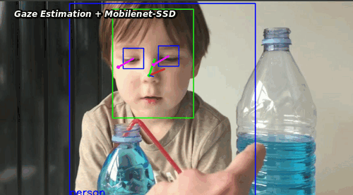
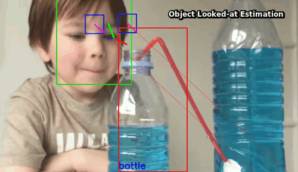
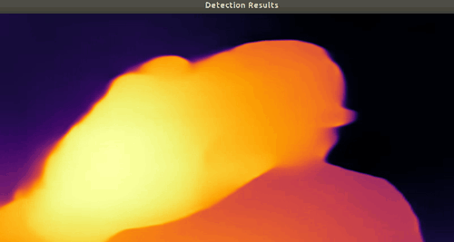

# Object-looked-at Estimation
Model that estimate the object you look at

## Openvino version  
...

## DepthAI ([Luxonis](https://luxonis.com/depthai)) version 

**Warnings:**  
Work In Progress...      
Still a lot of work before we have something fully functional. Any contribution is welcome!     
The gaze estimation model needs to be improved, but the first goal here is to make a functional pipeline.  
The object detection model will also be replaced at some point by a more accurate.  
  
The model currently only works with one person on video and at close range.  

**Model sources:**  
* Gaze estimation: [https://github.com/luxonis/depthai-experiments/tree/master/gaze-estimation](https://github.com/luxonis/depthai-experiments/tree/master/gaze-estimation)  
* Mobilenet-SSD: [https://github.com/luxonis/depthai-tutorials/tree/master/1-hello-world](https://github.com/luxonis/depthai-tutorials/tree/master/1-hello-world)  

**Run:**  

`python3 gaze_ssd.py -vid <video_path>`  
or
`python3 gaze_ssd.py -cam`

### First test on mono camera (OAK-1)

**Gaze estimation + Mobilenet-SSD:** 

The model currently run at (on i7-8700 host):  
* 24 FPS with video input from host  
* 18 FPS with onboard camera

**Intersection detection between detection-bboxs and gaze:**   

  

#### TODO

* Integration of Midas V2 model (MonoDepth)

Midas V2 running on NCS2:  

